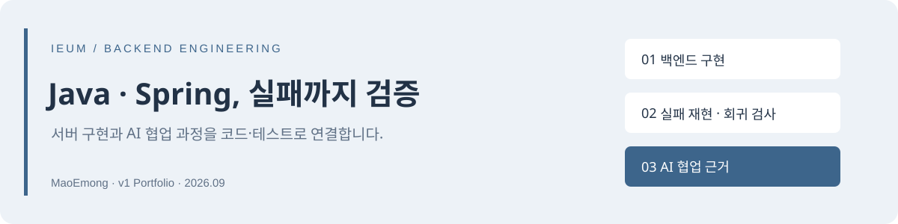
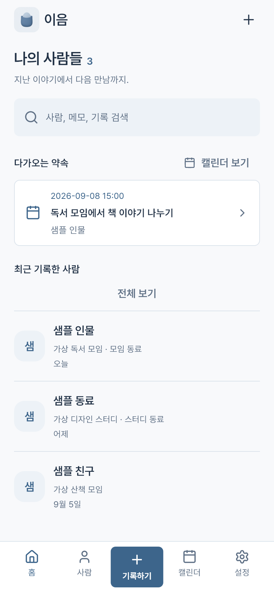
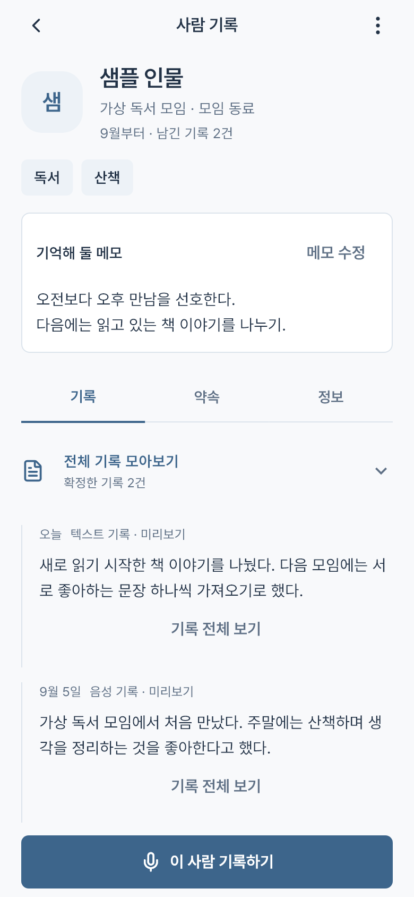
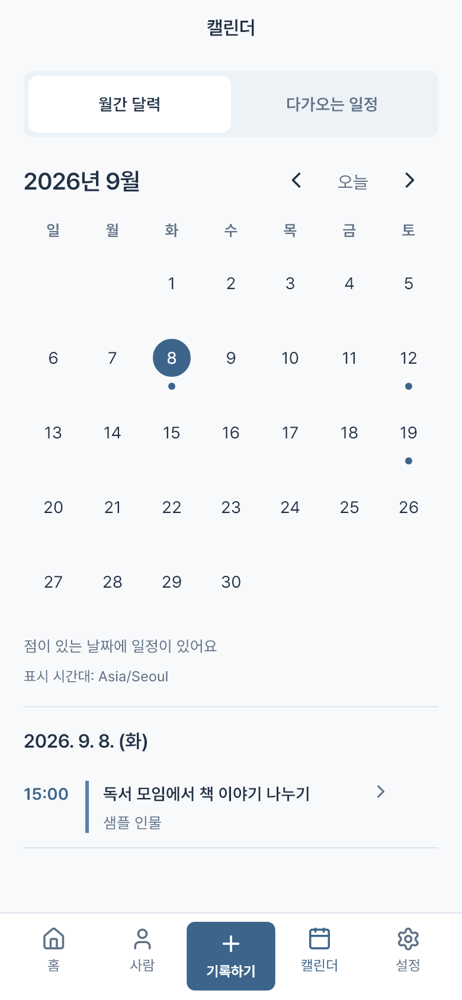

# 이음 | Java·Spring 백엔드와 AI 협업 개발



**MaoEmong · 백엔드 중심 개발 포트폴리오 · 서비스 v1 / 2026.09**

이음은 음성·텍스트·명함을 사람별 기록으로 모으고, 사용자가 확인한 약속을 달력에 연결하는 모바일 서비스입니다. 이 저장소는 서비스 소개보다 **서버의 실패 처리, 환경 격리, 회귀 검증과 AI 협업 과정**에 초점을 맞춥니다.

프로젝트는 1인 주도로 진행했고 AI 코딩 에이전트를 분석·구현·테스트 실행에 활용했습니다. 요구사항·사용자 시나리오·수정 승인과 AI가 수행한 코드 작업을 구분합니다. 모든 코드를 혼자 수작업으로 작성했다는 의미가 아닙니다.

> **PRIVATE / 소유자 검토 중.** 서비스 전체 소스나 원본 Git 이력을 공개한 저장소가 아닙니다. 아래 코드는 기술적 판단을 실행해서 확인할 수 있도록 새로 구성한 독립 예제입니다. 핵심 AI·검색 구현과 운영 자격증명은 포함하지 않습니다.

## 먼저 볼 것

1. [이력서 첨부 PDF](output/pdf/ieum-v1-portfolio.pdf) — 백엔드 사례와 AI 협업 근거를 5쪽으로 정리
2. [Java·Spring 실행 예제](examples/backend-boundaries/README.md) — 오류 응답과 실제 컨텍스트 기동 검사
3. [기술 사례의 원인·대안·검증](docs/engineering.md) — 어떤 실패를 어떻게 구분했는가
4. [AI 협업 과정](docs/ai-assisted-development.md) · [의사결정과 검증 요약](docs/evidence/ai-collaboration-summary.md) — 요구·판단·AI 지원·결과의 연결

## 백엔드에서 다룬 두 가지 문제

| 문제 | 구현 판단 | 검증 방법 |
|---|---|---|
| 파일 부재와 저장소 장애가 같은 오류로 보임 | 확정된 파일 부재만 404로 매핑하고 권한·연결·불명확한 오류와 구분 | 정상 바이트 대조, 오류별 HTTP 응답, 내부 정보 미노출, 조회 외 부작용 검사 |
| 잘못된 배포 설정으로 서버가 시작될 수 있음 | 개발 편의 기능은 유지하되 배포 환경에서 위험한 조합은 기동 거부 | 순수 설정 판정과 실제 Spring 컨텍스트 검사, 실패 원인 및 정상 기동 대조군 확인 |

핵심은 **어떤 오류를 변환할 수 있는지, 테스트가 의도한 코드까지 실행했는지**를 확인하는 것입니다. [구현·테스트 읽기](docs/engineering.md)

## 실행해서 확인하기

Java 21과 Maven을 준비하면 실제 서비스·DB·클라우드 계정 없이 실행할 수 있습니다.

```sh
cd examples/backend-boundaries
mvn --batch-mode verify
```

예제의 가짜 저장소와 테스트용 인증 문맥은 운영 구현이 아닙니다. 서비스에서 다뤘던 경계를 재구성했고, 오늘 실행한 예제의 결과와 과거 서비스 검증을 구분합니다. 상세 실행 방법과 의도적 결함 주입 검증은 [예제 안내](examples/backend-boundaries/README.md)를 참고하세요.

기존 [Dart 예제](examples/reliability/README.md)는 재시도 한도와 UTC·지역 식별자 왕복 보존을 다루는 보조 자료로 유지했습니다.

이 저장소의 Python 코드는 PDF 생성·검사, 공개 범위 검사, 선택적인 결함 검출 시연용 도구입니다. 서비스 백엔드는 Java·Spring이며, Python을 서비스 런타임이나 핵심 구현 기술로 제시하지 않습니다. `red_green.py`는 이번 포트폴리오를 위해 새로 추가한 실행 보조 스크립트입니다.

## AI 활용을 어떻게 확인할 수 있나

AI 사용 사실만 나열하지 않고, 각 사례에서 아래 근거를 연결합니다.

- **프로젝트 주도자의 요구·승인:** 개발 대화를 바탕으로 다듬은 의사결정 요약. 직접 인용이나 당시 대화 재현으로 표시하지 않습니다.
- **AI 지원 작업:** 개발 당시 사후 기록에 남은 분석·구현·테스트 활동. 사후 기록을 원본 실행 로그라고 부르지 않습니다.
- **기술적 결과:** 읽을 수 있는 코드, 실패 조건과 기대 응답, 다시 실행할 수 있는 테스트·CI.
- **검증의 경계:** 현재 예제의 통과는 과거 개발 순서나 작성자를 증명하지 않습니다. 생성 코드 비율·시간 절감률은 측정하지 않았습니다.

[협업 사례와 역할 구분](docs/ai-assisted-development.md)에서 AI에게 맡긴 작업, 주도자가 요구한 검증, 남은 한계를 함께 설명합니다. 대화는 다듬은 설명으로만 정리하며, 원문 발언·전체 대화 공유 링크·민감한 원시 로그는 싣지 않습니다. 이 저장소는 선별한 현재 파일만으로 Git 이력을 새로 시작한 독립 포트폴리오입니다.

## 서비스 구조와 경험 범위

| 영역 | 사용 기술·책임 |
|---|---|
| API | Java 21 · Spring Boot · JPA, 사용자별 기록·일정 저장 및 파일 접근 |
| 데이터 | PostgreSQL · pgvector · Flyway, 관계형 데이터·검색·스키마 이력 |
| 원본 파일 | Supabase private Storage, 서버 인스턴스와 분리한 파일 저장 |
| 앱 | Flutter · Dart · Riverpod, 입력·검수·비동기 상태와 캘린더 |
| 검증·배포 | 자동 테스트 · Docker · GitHub Actions · Render 스테이징 |

[서버 중심 구조와 신뢰 경계](docs/architecture.md). 일부 추론·OCR·임베딩은 기기에서 처리하며 음성 전사는 서버와 외부 STT를 거칩니다. 완전 오프라인 구조나 AWS 운영 경험으로 설명하지 않습니다.

## 서비스 화면

<table>
  <tr>
    <td></td>
    <td></td>
    <td></td>
  </tr>
</table>

실제 Flutter 위젯을 합성 인물·메모·일정으로 렌더링한 화면이며 실기기 캡처는 아닙니다. [이미지 출처](docs/asset-notes.md)

## 검증과 공개 범위

서비스 v1 배포 전 기록은 백엔드 210개, 앱 834개 통과입니다. 앱 조건부 스킵 17개와 별도 환경 검사, 재배포 후 합성 사진 1개의 보존 확인을 [검증 문서](docs/verification.md)에 구분했습니다. 이 숫자를 코드 커버리지·AI 정확도·오늘 실행한 예제 결과로 해석하지 않습니다.

이 저장소의 [CI](.github/workflows/portfolio-ci.yml)는 공개용 예제·문서·PDF만 검사하며 실제 서비스에 배포하지 않습니다. [공개 검토 체크리스트](docs/disclosure.md) · [권리 안내](RIGHTS.md) · [PDF 재생성](scripts/README.md)

프로젝트 소유자: [MaoEmong](https://github.com/MaoEmong)
