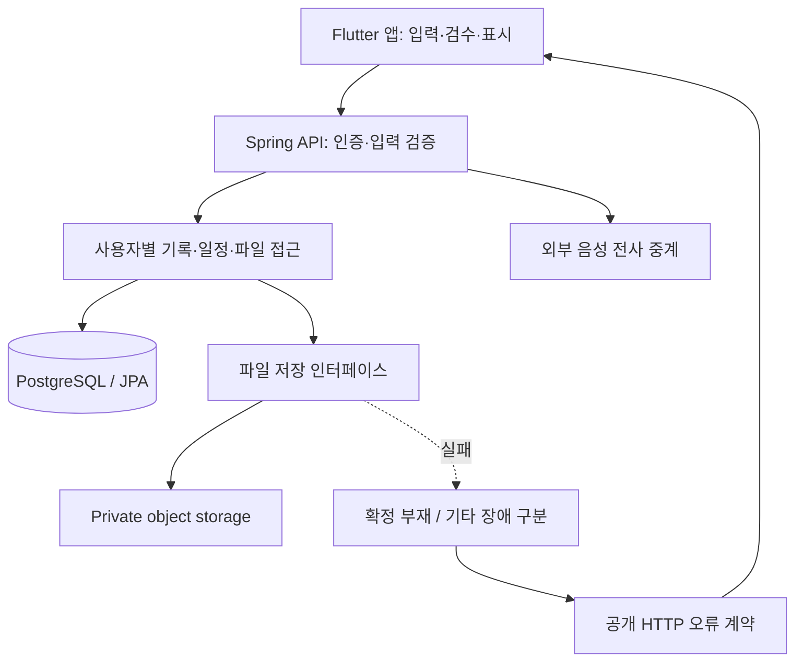

# 백엔드 구조와 신뢰 경계

논리 구조와 책임을 설명하는 문서입니다. 운영 주소·실제 스키마·인증 설정·핵심 AI 및 검색 구현은 포함하지 않습니다.

## 서비스의 요청 흐름

| 경계 | 책임 | 포트폴리오에서 보여주는 범위 |
|---|---|---|
| HTTP → 애플리케이션 | 인증·입력·사용자 접근 제한 | 예제는 테스트용 사용자 문맥만 사용. 실제 SNS·JWT 구현은 제외 |
| 애플리케이션 → 파일 저장 | 저장 구현과 호출자의 분리 | 가짜 저장소를 주입해 성공·부재·장애를 재현 |
| 저장소 실패 → HTTP | 내부 상세를 숨기고 오류 의미를 전달 | 응답 상태·공개 오류 코드·부작용을 검사 |
| 설정 → Spring 생명주기 | 위험한 배포 설정의 기동 차단 | 판정 함수와 실제 컨텍스트, 정상 대조군을 분리 검사 |

DB 참조와 원본 파일이 서로 다른 자원에 존재하므로, DB 조회 성공만으로 파일 보존을 판정하지 않습니다. 객체 저장소 채택이 DB·파일 간 원자적 트랜잭션을 제공한다는 뜻도 아닙니다.

## 설계 선택과 대가

- **저장 인터페이스 분리:** 공급자 실패를 호출자가 직접 해석하지 않도록 합니다. 대신 오류 의미를 보수적으로 분류하고 실제 공급자 동작을 별도로 검증해야 합니다.
- **배포 환경 기동 차단:** 잘못된 설정을 요청 처리 전에 발견합니다. 대신 가드 빈이 실제로 실행되는지와 정상 환경의 기동을 함께 검사해야 합니다.
- **PostgreSQL + JPA + Flyway:** 관계형 저장과 스키마 변경 이력을 관리합니다. 공개 예제는 DB·마이그레이션 자체를 재현하지 않습니다.
- **앱·서버 분리:** 앱은 입력·검수·일부 기기 내 처리를, 서버는 저장·사용자 접근·외부 STT 중계를 담당합니다. 화면 복구와 서버 가용성은 각각 검증해야 합니다.

## AI 기능과 AI 개발 도구는 다른 축

서비스의 일부 추론·OCR·임베딩은 기기 내에서 실행하고 음성 전사는 서버와 외부 STT를 거칩니다. AI 제안을 사용자의 확정 기록과 분리하는 제품 정책과, 개발 중 AI 코딩 에이전트를 활용한 방식은 별개의 사례입니다. 후자는 [협업 문서](ai-assisted-development.md)에 정리했습니다.

현재 확인 환경은 Render API와 Supabase DB·Storage의 **스테이징**입니다. 이 구조 설명은 AWS 운영·대규모 사용자 부하·스토어 출시의 증거가 아닙니다. 공개용 CI는 독립 예제만 검사하며 서비스 자격증명을 사용하지 않습니다.
